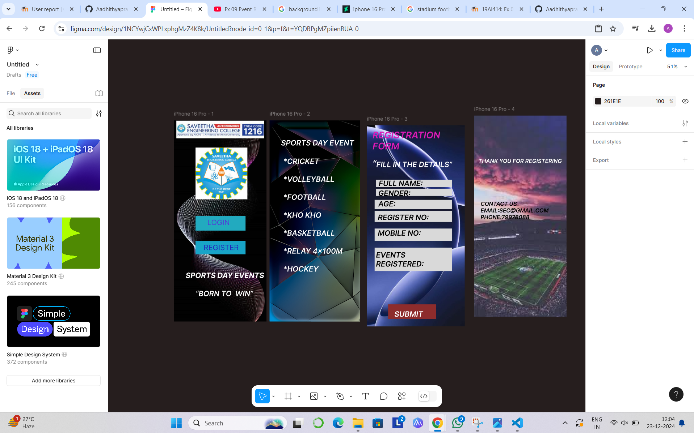

# Ex09 Event Registration Web Application
## Date:23-12-24

## AIM:
To design, develop and deploy a web application for event registration.

## DESIGN STEPS:

### Step 1:
Create a new frame.

### Step 2:
Select any one preset size of your choice.

### Step 3:
Select the shapes you need.

### Step 4:
Import images as needed.

### Step 5:
Create pages based on your need and link them.

### Step 6:

Validate the HTML and CSS code.

### Step 6:

Publish the website in the given URL.

## DESIGN TOOL:
Figma

## CODE:
```
HOME PAGE
<div style="width: 402px; height: 874px; position: relative; background: #40CBD8">
  
  <div style="left: 51px; top: 654px; position: absolute; color: white; font-size: 32px; font-family: Inter; font-style: italic; font-weight: 700; word-wrap: break-word">SPORTS DAY EVENTS</div>
  
  <div style="width: 217px; height: 64px; left: 94px; top: 415px; position: absolute; background: #22AABF"></div>
  <div style="left: 145px; top: 424px; position: absolute; color: #5632DA; font-size: 32px; font-family: Inter; font-weight: 400; word-wrap: break-word">LOGIN</div>
  <div style="width: 217px; height: 59px; left: 94px; top: 523px; position: absolute; background: #18A4C7"></div>
  <div style="width: 182px; left: 129px; top: 533px; position: absolute; color: #2424BC; font-size: 32px; font-family: Inter; font-weight: 400; word-wrap: break-word">REGISTER</div>
  
  <div style="left: 94px; top: 733px; position: absolute; color: white; font-size: 32px; font-family: Inter; font-style: italic; font-weight: 600; word-wrap: break-word">“BORN TO  WIN”</div>
</div>
PAGE 2
<div style="width: 392px; height: 874px; position: relative; background: #D50BD1">
  
  <div style="width: 342px; height: 38px; left: 50px; top: 78px; position: absolute; color: white; font-size: 32px; font-family: Inter; font-style: italic; font-weight: 600; word-wrap: break-word">SPORTS DAY EVENT</div>
  <div style="left: 59px; top: 158px; position: absolute; color: white; font-size: 32px; font-family: Inter; font-style: italic; font-weight: 600; word-wrap: break-word">*CRICKET<br/>  <br/>*VOLLEYBALL<br/><br/>*FOOTBALL<br/><br/>*KHO KHO<br/><br/>*BASKETBALL<br/><br/>*RELAY 4x100M<br/><br/>*HOCKEY</div>
</div>
page 3
<div style="width: 424px; height: 874px; position: relative; background: #C73434">
  
  <div style="width: 327px; height: 102px; left: 24px; top: 18px; position: absolute; color: #DD1AB6; font-size: 40px; font-family: Inter; font-style: italic; font-weight: 600; word-wrap: break-word">REGISTRATION <br/>FORM</div>
  <div style="width: 368px; height: 49px; left: 24px; top: 143px; position: absolute"><span style="color: white; font-size: 40px; font-family: Inter; font-style: italic; font-weight: 600; word-wrap: break-word">“</span><span style="color: white; font-size: 32px; font-family: Inter; font-style: italic; font-weight: 600; word-wrap: break-word">FILL IN THE DETAILS”</span></div>
  <div style="width: 330px; height: 31px; left: 39px; top: 237px; position: absolute; background: #D9D9D9"></div>
  <div style="width: 330px; height: 31px; left: 39px; top: 276px; position: absolute; background: #D9D9D9"></div>
  <div style="left: 49px; top: 276px; position: absolute; color: black; font-size: 32px; font-family: Inter; font-style: italic; font-weight: 600; word-wrap: break-word">GENDER:</div>
  <div style="width: 336px; height: 40px; left: 33px; top: 324px; position: absolute; background: #D9D9D9"></div>
  <div style="left: 49px; top: 322px; position: absolute; color: black; font-size: 32px; font-family: Inter; font-style: italic; font-weight: 600; word-wrap: break-word">AGE:</div>
  <div style="width: 336px; height: 47px; left: 33px; top: 373px; position: absolute; background: #D9D9D9"></div>
  <div style="left: 47px; top: 381px; position: absolute; color: black; font-size: 32px; font-family: Inter; font-style: italic; font-weight: 600; word-wrap: break-word">REGISTER NO:</div>
  <div style="width: 336px; height: 54px; left: 33px; top: 449px; position: absolute; background: #D9D9D9"></div>
  <div style="left: 47px; top: 449px; position: absolute; color: black; font-size: 32px; font-family: Inter; font-style: italic; font-weight: 600; word-wrap: break-word">MOBILE NO:</div>
  <div style="width: 4px; height: 4px; left: 162px; top: 811px; position: absolute; background: #D9D9D9"></div>
  <div style="width: 336px; height: 102px; left: 33px; top: 532px; position: absolute; background: #D9D9D9"></div>
  <div style="width: 312px; height: 55px; left: 39px; top: 544px; position: absolute; color: black; font-size: 32px; font-family: Inter; font-style: italic; font-weight: 600; word-wrap: break-word">EVENTS REGISTERED:</div>
  <div style="left: 51px; top: 233px; position: absolute; color: black; font-size: 32px; font-family: Inter; font-style: italic; font-weight: 600; word-wrap: break-word">FULL NAME:</div>
  <div style="width: 207px; height: 64px; left: 92px; top: 778px; position: absolute; background: #8D2C2C"></div>
  <div style="left: 119px; top: 801px; position: absolute; color: white; font-size: 32px; font-family: Inter; font-style: italic; font-weight: 600; word-wrap: break-word">SUBMIT</div>
</div>
page 4
<div style="width: 402px; height: 874px; position: relative; background: white">
  
  <div style="left: 19px; top: 183px; position: absolute; color: white; font-size: 24px; font-family: Inter; font-style: italic; font-weight: 600; word-wrap: break-word">THANK YOU FOR REGISTERING</div>
  <div style="width: 303px; height: 99px; left: 29px; top: 369px; position: absolute; color: black; font-size: 24px; font-family: Inter; font-style: italic; font-weight: 600; word-wrap: break-word">CONTACT US<br/>EMAIL:SEC@GMAIL.COM<br/>PHONE:79978088</div>
</div>
```

## OUTPUT:



## RESULT:
The program to design, develop and deploy a web application for event registration is completed successfully.
